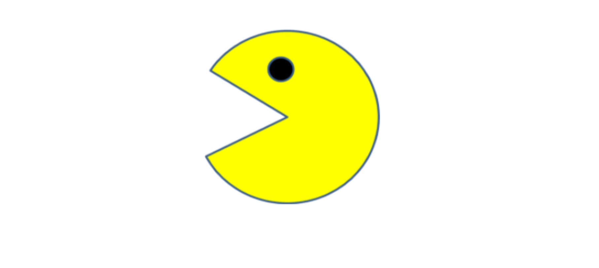

# PacMan-Excercise
This is a basic animation Excercise using Arcade's image PacMan

<h2> Description </h2>

 This prject is a simple <b>animation excercise</b> in which I use an arcade-based Pacman image and I give it movement taking certain parameters such as the direction of the image, the change in postition, the focus which is the state of the face of the Pacman and then I set a function to make the image to be excecuted over a specific time interval

 

<h2>Instalation</h2>
<ul>
<li>The code is free to download on this respository</li>
<li>You might just need a code editor and an Internet Browser, my recomendation<b>Chrome</b></li>
<li>If you are using<b>VSCode</b> I recommend to download the<b>Live Server</b> extension so you can see your changes as soon as you hit <i>Comand+s</i></li>  
</ul>
 
  
<h2>Usage</h2>

 This excercise has basically learning purposes, there are some interesting aplications on the use of two dimentional arrays, on how to call a function in a certain interval of time and how to create a switch 1 -0-1 logic in order to alternate outcomes. The applications of the concepts are enormous however the excersise itself pretty much explains the behaviour of a function that animates an image 

 

<h2>Support</h1>

 If you are stuck somewhere in this code, please feel free to contact me at: 

<h4>Email:</h4>
<a href="mailto:jplarraga@gmail.com">jplarraga@gmail.com</a>
<h4>Twitter:</h4>

@jplarraga

 

<h2>Roadmap</h2>

 This is the first project and I don't spect to add future improvements, however I am Strongly encouraged to keep adding repositories related to the same excercise but I will keep adding more complexity or more variables in it so it gets more dynamic and up to the point where the game is created

 
  
<h2>License Information</h2>

Copyright (c) 2021 Juan Larraga

Permission is hereby granted, free of charge, to any person obtaining a copy of this software and associated documentation files (the "Software"), to deal in the Software without restriction, including without limitation the rights to use, copy, modify, merge, publish, distribute, sublicense, and/or sell copies of the Software, and to permit persons to whom the Software is furnished to do so, subject to the following conditions:

The above copyright notice and this permission notice shall be included in all copies or substantial portions of the Software.

THE SOFTWARE IS PROVIDED "AS IS", WITHOUT WARRANTY OF ANY KIND, EXPRESS OR IMPLIED, INCLUDING BUT NOT LIMITED TO THE WARRANTIES OF MERCHANTABILITY, FITNESS FOR A PARTICULAR PURPOSE AND NONINFRINGEMENT. IN NO EVENT SHALL THE AUTHORS OR COPYRIGHT HOLDERS BE LIABLE FOR ANY CLAIM, DAMAGES OR OTHER LIABILITY, WHETHER IN AN ACTION OF CONTRACT, TORT OR OTHERWISE, ARISING FROM, OUT OF OR IN CONNECTION WITH THE SOFTWARE OR THE USE OR OTHER DEALINGS IN THE SOFTWARE. 

